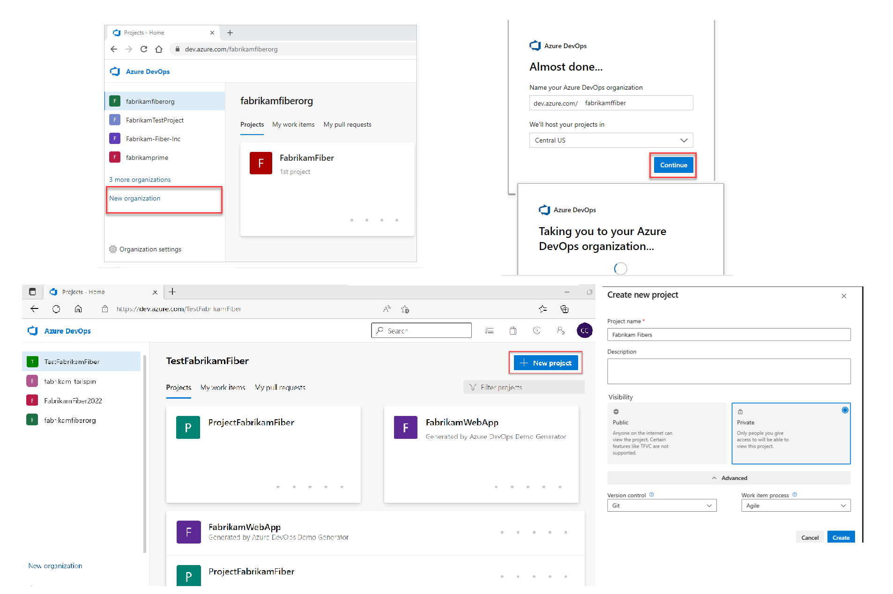
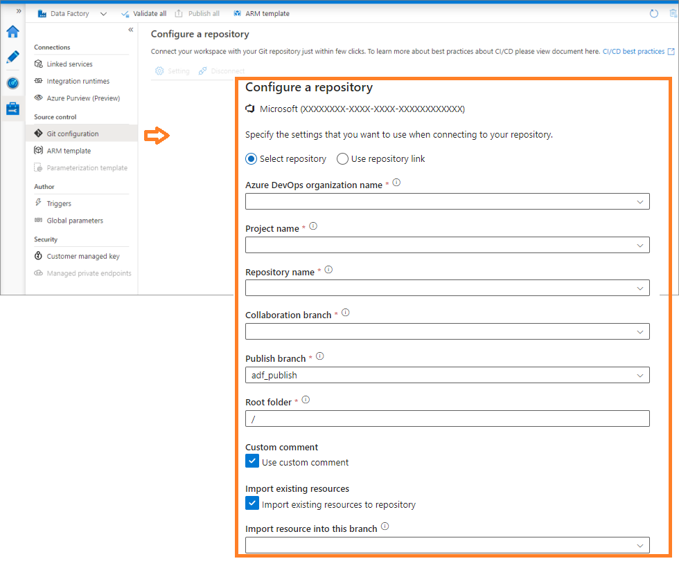

# Integração Azure Data Factory ao Azure Devops

#adf-devops-integration #readme #azuredatafactory #azuredevops

Este projeto demonstra como integrar o Azure Data Factory (ADF) ao Azure DevOps para garantir versionamento, controle de mudanças e governança no desenvolvimento de pipelines de dados.

##  Objetivo:

- Versionar pipelines, datasets e linked services do ADF usando Git.
- Facilitar rastreamento de alterações e colaboração em equipe
- Estabelecer base para CI/CD com Azure DevOps

## Etapas do Projeto:

### 1. Criar organização e projeto no Azure DevOps
- Acesse [https://dev.azure.com](https://dev.azure.com)
- Crie uma nova organização e um projeto privado
- Dentro do projeto, crie um repositório Git vazio

https://learn.microsoft.com/pt-br/azure/devops/organizations/accounts/create-organization?view=azure-devops
https://learn.microsoft.com/pt-br/azure/devops/organizations/projects/create-project?view=azure-devops&tabs=browser
https://learn.microsoft.com/pt-br/azure/devops/organizations/projects/about-projects?view=azure-devops#structure-your-project

### 2. Criar Azure Data Factory no portal do Azure
- Nomeie o recurso (ex: `adf-projeto-demo`)
- Durante a criação, selecione a opção “Configure Git later” (você pode conectar depois)

### 3. Conectar ADF ao Git
- No portal do Azure, abra seu ADF e clique em ⚙️ "Manage" > "Git configuration"
- Conecte com a conta do DevOps e selecione:
  - Repositório desejado
  - Branch de colaboração (`main`, por exemplo)
  - Root folder (ex: `/adf`)
  - Publicar branch (`adf_publish`)

https://learn.microsoft.com/pt-br/azure/data-factory/source-control

### 4. Versionamento automático
- A partir de agora, tudo que você editar no ADF Studio será salvo automaticamente no Git
- O botão "Publish" envia para o branch `adf_publish`, que representa o ambiente ativo

### 5. Estrutura criada no Git
Após a conexão, o repositório terá pastas como:
/adf 
/pipelines 
/datasets 
/linkedServices

---

## Insights e Aprendizados

- Versionamento melhora rastreabilidade e facilita o trabalho em equipe
- O uso do branch `adf_publish` permite isolar o ambiente em produção
- A estrutura pronta no Git já prepara para futuras automações com CI/CD

---

